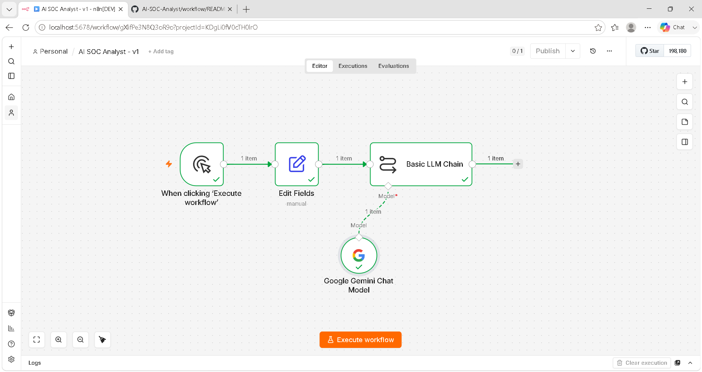
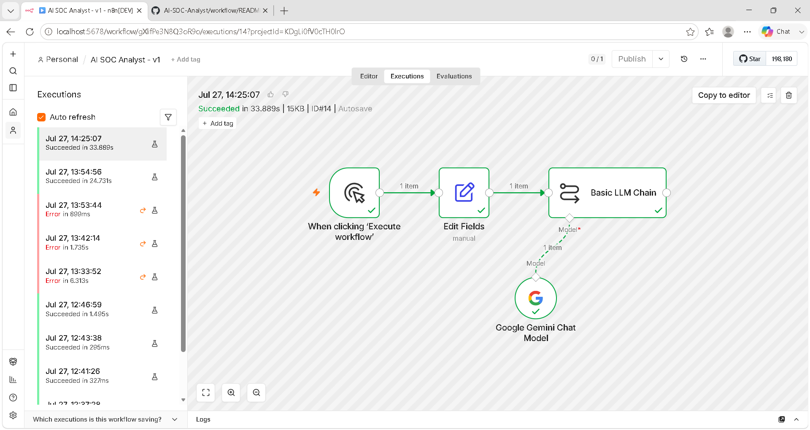
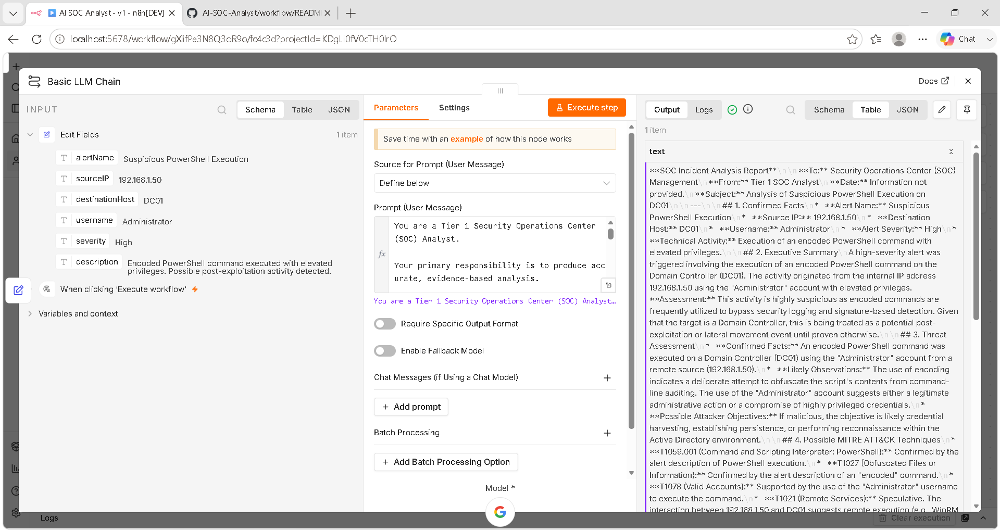

# 🛡️ AI-Powered SOC Incident Analysis Assistant

> An AI-powered Security Operations Center (SOC) workflow built with **n8n** and **Google Gemini** that analyzes security alerts, distinguishes confirmed facts from assumptions, maps threats to the MITRE ATT&CK framework, recommends containment actions, and generates professional incident analysis reports.

---

## 📖 Overview

Modern Security Operations Centers (SOCs) process thousands of security alerts every day. Analysts must rapidly determine which alerts require immediate attention while avoiding false positives and unsupported conclusions.

This project demonstrates how Artificial Intelligence and workflow automation can assist SOC analysts by generating structured, evidence-based incident reports. The workflow accepts a security alert, enriches it with carefully engineered prompts, and produces a professional SOC analysis while explicitly separating confirmed facts from analytical observations and assumptions.

This project was built as part of my AI Automation & Cybersecurity portfolio to demonstrate practical skills in workflow automation, prompt engineering, cybersecurity analysis, and AI-assisted incident response.

---

## ✨ Features

- 🤖 AI-powered security alert analysis
- 🛡️ Evidence-based incident reporting
- 🎯 MITRE ATT&CK technique mapping
- 🔍 Indicator of Compromise (IOC) extraction
- 🚨 Threat assessment and prioritization
- 📊 Confidence level scoring
- 🧠 Separation of facts, observations, and assumptions
- 🔐 Containment recommendations
- 📋 Investigation guidance
- ⚡ Dynamic prompt engineering using n8n expressions

---

## 🛠 Technology Stack

| Technology | Purpose |
|------------|---------|
| n8n | Workflow Automation |
| Google Gemini | Large Language Model |
| Google AI Studio | AI API Platform |
| JSON | Structured Data |
| Prompt Engineering | AI Guidance |
| MITRE ATT&CK | Threat Mapping |
| GitHub | Version Control |

---

## 🧠 Workflow

The workflow follows a simple but powerful pipeline:

Manual Trigger

↓

Security Alert (Edit Fields)

↓

Prompt Engineering

↓

Google Gemini

↓

SOC Incident Analysis Report

---

## 📂 Project Structure

```text
AI-SOC-Analyst/
│
├── .github/
├── docs/
├── examples/
├── images/
├── prompts/
├── workflow/
├── LICENSE
├── CHANGELOG.md
├── CONTRIBUTING.md
├── README.md
└── .gitignore
```

---

## 📸 Screenshots

### Workflow



---

### Execution



---

### AI Output



---

## 🧠 Prompt Engineering Highlights

This workflow demonstrates several prompt engineering best practices:

- Dynamic variable injection using n8n expressions
- Evidence-based reasoning
- Explicit separation of facts and assumptions
- Confidence scoring
- Hallucination reduction techniques
- Structured SOC reporting
- Professional cybersecurity terminology

---

## 🛡 Example Analysis

The AI report includes:

- Confirmed Facts
- Executive Summary
- Threat Assessment
- MITRE ATT&CK Mapping
- Indicators of Compromise
- Containment Recommendations
- Investigation Steps
- Confidence Level
- Overall Risk Rating

---

## 📚 Documentation

Additional documentation can be found in the **docs** folder.

- Architecture
- Installation Guide
- MITRE ATT&CK Notes
- Troubleshooting
- Future Roadmap

---

## 🚀 Future Roadmap

### Version 1.1

- Retry logic
- Improved confidence scoring
- IOC enrichment

### Version 2

- VirusTotal Integration

### Version 3

- AbuseIPDB Integration

### Version 4

- Microsoft Sentinel Integration

### Version 5

- Wazuh Integration

### Version 6

- Splunk Integration

### Version 7

- OpenCTI Integration

### Version 8

- AWS GuardDuty Integration

---

## 🤝 Contributing

Contributions, suggestions, and improvements are welcome.

Please read **CONTRIBUTING.md** before submitting pull requests.

---

## 📄 License

This project is licensed under the MIT License.

---

## 👨‍💻 Author

**Luthando Yekani**

Cybersecurity • AI Automation • Networking • Cloud • AWS

Building practical AI-powered cybersecurity solutions.
